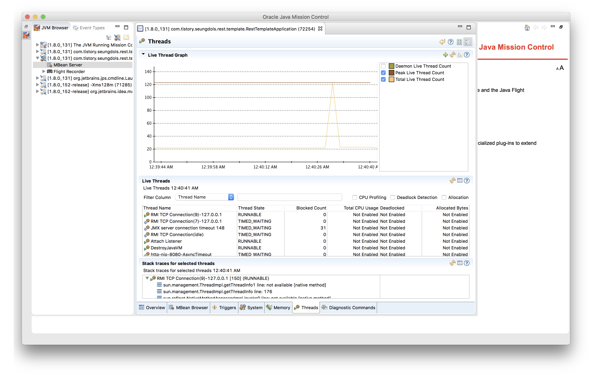

# 비동기 RestTemplate과 비동기 MVC servlet 

링크드인에서 발표한 자료 중 Play framework로 링크드인의 백엔드 서버를 구성하고, `MSA`로 구성 했으나, 결국에는 `Thread pool hell`에 빠지게 되었다는 자료가 있다. 

* 참고 - [Thread pool usageLatencyThread pool hell](https://www.slideshare.net/brikis98/the-play-framework-at-linkedin/8-Thread_pool_usageLatencyThread_pool_hell)

백엔드를 잘게 찢어 놓더라도 백엔드의 응답 시간이 있고, 또 다른 백엔드의 응답을 받아 조합해서 화면을 구성해야 하는 경우에는 `Thread pool hell`에 해당 하는 경우, `Latency`가 급격하게 증가하는 현상을 겪는다.

이런 구조를 막고자 하지만, 내부의 서비스 내에서 혹은 내부 시스템 상에서 이러한 구조를 갖게 되지만, 외부 웹 환경에서도 이러한 문제가 발생한다. 

터미널에서 `jmc`를 입력하면, `Java Mission Control`이라는 툴이 뜨는데, 이 툴이 생각보다 유용하다. (Oracle JDK에 포함 되어 있으나, 상용 웹에 쓰려고 한다면 라이센스를 지불해야한다.)


```java
@SpringBootApplication
public class RestTemplateApplication {

    @RestController
    public static class MyController {

        RestTemplate rt = new RestTemplate();

        @RequestMapping("/rest")
        public String rest(int idx) {
            return "hello " + idx; //http body 내에 포함 되게 된다.
        }

    }

    public static void main(String[] args) {
        SpringApplication.run(RestTemplateApplication.class, args);
    }
}

```


```java
public class LoadTest {

    static AtomicInteger counter = new AtomicInteger(0);

    public static void main(String[] args) throws InterruptedException {
        ExecutorService es = Executors.newFixedThreadPool(100);

        RestTemplate restTemplate = new RestTemplate();
        String url = "http://localhost:8080/rest";

        StopWatch main = new StopWatch();
        main.start();

        for (int i = 0; i < 100; i++) {
            es.execute(() -> {
                int idx = counter.addAndGet(1);
                
                log.debug("Thread {}", idx);

                StopWatch stopWatch = new StopWatch();
                stopWatch.start();

                restTemplate.getForObject(url, String.class);
                stopWatch.stop();
                log.info("Elapsed: {} {}", idx, stopWatch.getTotalTimeSeconds());
            });
        }

        es.shutdown();
        es.awaitTermination(100, TimeUnit.SECONDS);

        main.stop();
        log.info("Total: {}", main.getTotalTimeSeconds());
    }

}

```

위와 같은 부하테스트 코드를 사용 했지만, 생각보다 깔끔한 편은 아니다. 그래서 아래처럼 `CyclicBarrier`를 추가한다. 
그런데, `es.execute`를 사용했는데, 이에 대한 에러 처리를 할 수 없다. 이유는 `execute`는 `Runnable`이라 에러 처리가 어려운데, 이를 `submit`으로 변경해주고, 의미는 없지만, `return`구문을 만들어주면 된다. 

```java
@Slf4j
public class LoadTest {

    static AtomicInteger counter = new AtomicInteger(0);

    public static void main(String[] args) throws InterruptedException {
        ExecutorService es = Executors.newFixedThreadPool(100);

        RestTemplate restTemplate = new RestTemplate();
        String url = "http://localhost:8080/rest";

        CyclicBarrier barrier = new CyclicBarrier(100);


        for (int i = 0; i < 100; i++) {
            es.submit(() -> {
                int idx = counter.addAndGet(1);

                barrier.await();

                log.debug("Thread {}", idx);

                StopWatch stopWatch = new StopWatch();
                stopWatch.start();

                restTemplate.getForObject(url, String.class);
                stopWatch.stop();
                log.info("Elapsed: {} {}", idx, stopWatch.getTotalTimeSeconds());
                
                return null;
            });
        }

        StopWatch main = new StopWatch();
        main.start();

        es.shutdown();
        es.awaitTermination(100, TimeUnit.SECONDS);

        main.stop();
        log.info("Total: {}", main.getTotalTimeSeconds());
    }

}

```

`CyclicBarrier`를 만들고, 임계 수치를 제한 해둔 다음, `await()`을 호출하게 되면, 해당 요청이 모두 올 때까지 기다렸다가 이후 처리를 하게 된다. (쓰레드 동기화라고도 표현 한다고 한다.)


**RestTemplateApplication**

```java
@SpringBootApplication
public class RestTemplateApplication {

    @RestController
    public static class MyController {

        RestTemplate rt = new RestTemplate();

        @RequestMapping("/rest")
        public String rest(int idx) {
            String res = rt.getForObject("http://localhost:8081/service?req={req}", String.class, "hello" + idx);
            return res; //http body 내에 포함 되게 된다.
        }

    }

    public static void main(String[] args) {
        SpringApplication.run(RestTemplateApplication.class, args);
    }
}
```

**RemoteService**

```java
@SpringBootApplication
public class RemoteService {

    @RestController
    public static class MyController {

        @RequestMapping("/service")
        public String rest(String req) {
            return req + " /service"; //http body 내에 포함 되게 된다.
        }

    }

    public static void main(String[] args) {
        System.setProperty("server.port", "8081");
        System.setProperty("server.tomcat.max-threads", "1000");
        SpringApplication.run(RemoteService.class, args);
    }
}
```


사실 위에서 처럼 테스트를 해보려고 하나, 현실적이지는 않다. 그래서 `RemoteService`를 호출 하는데, 하나의 요청당 2초정도 `sleep`을 준다. 


```java
@SpringBootApplication
public class RemoteService {

    @RestController
    public static class MyController {

        @RequestMapping("/service")
        public String rest(String req) throws InterruptedException {

            Thread.sleep(2000);
            return req + " /service"; //http body 내에 포함 되게 된다.

        }

    }

    public static void main(String[] args) {
        System.setProperty("server.port", "8081");
        System.setProperty("server.tomcat.max-threads", "1000");
        SpringApplication.run(RemoteService.class, args);
    }
}

```

그런데, 중요한점은 `RestTemplateApplication`에서 `getForObject`는 **blocking**이기에 `Thread`들이 요청을 보내고 응답을 받을 때까지 기다려야 한다.

```java
@SpringBootApplication
public class RestTemplateApplication {

    @RestController
    public static class MyController {

        RestTemplate rt = new RestTemplate();

        @RequestMapping("/rest")
        public String rest(int idx) {
            String res = rt.getForObject("http://localhost:8081/service?req={req}", String.class, "hello" + idx);//이 부분이 Blocking Reqeust/Response
            return res; //http body 내에 포함 되게 된다.
        }

    }

    public static void main(String[] args) {
        SpringApplication.run(RestTemplateApplication.class, args);
    }
}
```

Quiz) 이 경우에는 하나의 요청 이후 다음 요청은 몇초가 걸리게 될까요? 

이 경우에는 CPU는 놀고 있는데, 처리는 정상적으로 되지 않는다. 고로 장애다. 
다만, 스프링 3.x에서도 간단하게 해결이 안된다. 그리고 `Callable`, `DeferredResult`를 쓴다고 해도 이 상황에서는 쉽게 해결이 되지 않는다. 

`DeferredResult`를 사용한다고 해도 외부에서 별개의 이벤트가 생겼을때, 처리 하는 것이다. 그리고, `Callable`을 쓴다고 해도 내부의 `Working Thread`를 생성하는 것이라 이 또한 문제가 있다. 

그래서 스프링 4.0에서는 `AsyncRestTemplate`이 생겨났다. 

```java
    @RestController
    public static class MyController {

        AsyncRestTemplate rt = new AsyncRestTemplate();

        @RequestMapping("/rest")
        public ListenableFuture<ResponseEntity<String>> rest(int idx) {
            ListenableFuture<ResponseEntity<String>> res = rt.getForEntity("http://localhost:8081/service?req={req}", String.class, "hello" + idx);
            return res; //http body 내에 포함 되게 된다.
        }

    }
```

`Callback`에 대해서는 스프링 MVC가 알아서 등록을 해주고, `Callback`에 대해서 생각할 필요가 없다. 

다만, 이렇게 처리를 할 경우에 톰캣 쓰레드는 1개이지만, `AsyncRestTemplate`를 쓰게 되면, 비동기 요청은 받지만, 쓰레드를 내부적으로 생성해서 처리를 한다. (서버 자원의 쓰레드 100개를 사용하게 됨.)
`Spring framework 5`부터 `AsyncRestTemplate`이 `@Deprecated`가 되었다. 그래서 [WebClient](https://docs.spring.io/spring-framework/docs/5.0.0.M3/javadoc-api/org/springframework/web/client/reactive/WebClient.html)를 써야한다. 참고 - [spring 5 webclient](https://www.baeldung.com/spring-5-webclient)



그래서, `apache async http client`, 혹은 `netty`를 사용하면 된다. (`netty`는 Line에 계신 Trustin이라는 이희승님이 만들었고, 전 세계적으로 많이 사용하는 Network Framework입니다. 사실, 내부적으로 Java NIO에 지대한 영향을 끼침.)

```java
AsyncRestTemplate rt = new AsyncRestTemplate(new Netty4ClientHttpRequestFactory(new NioEventLoopGroup(1)));
```

`AsyncRestTemplate`에 `Netty4ClientHttpRequestFactory`을 넣어주는데, 우리는 쓰레드를 1개만 사용할 것 이라, 쓰레드의 개수를 1개로 제한한다. (본래는 `Netty`자체가 프로세스 수 * 2를 해준 값으로 생성해준다고 한다.)

그런데, 여기서 궁금한 것이 생긴다. 비동기 요청에 대해서 응답을 가공해야 한다면, 어떻게 해야 할까? 

```java
@SpringBootApplication
public class RestTemplateApplication {

    @RestController
    public static class MyController {

        AsyncRestTemplate rt = new AsyncRestTemplate(new Netty4ClientHttpRequestFactory(new NioEventLoopGroup(1)));

        @RequestMapping("/rest")
        public DeferredResult<String> rest(int idx) {
            DeferredResult<String> deferredResult = new DeferredResult<>();
            ListenableFuture<ResponseEntity<String>> res = rt.getForEntity("http://localhost:8081/service?req={req}", String.class, "hello" + idx);

//            res.get() 이렇게 쓰면 블럭킹.

            //Callback 방식으로 비동기 요청에 대한 결과를 가공 하는 방법.
            res.addCallback(s -> {
                deferredResult.setResult(s.getBody() + " /work");
            }, e -> {
                deferredResult.setErrorResult(e.getMessage());
            });

            return deferredResult; //http body 내에 포함 되게 된다.


        }

    }

    public static void main(String[] args) {
        SpringApplication.run(RestTemplateApplication.class, args);
    }
}

```

정답은 `DeferredResult`를 사용하면 된다. 

그런데, 여기서 `MSA`환경이라면, 여러 `API`에 요청을 비동기로 막 날린 후에, 응답을 받아서 선택적으로 가공하고, 다시 요청을 날릴 수도 있다. 
그럴 경우를 가정해보자. 

`RemoteService`를 바꿔보자, 우선 먼저 `RestTemplateApplication`으로 초기 요청이 도착하고, 그 후에 `service1`로 요청을 보낸다. 
그리고, 비동기 요청에 대한 응답을 받아서 다시 `service2`로 요청을 보낸다. 

```java
@SpringBootApplication
public class RemoteService {

    @RestController
    public static class MyController {

        @RequestMapping("/service1")
        public String service1(String req) throws InterruptedException {

            Thread.sleep(2000);
            return req + " /service1"; //http body 내에 포함 되게 된다.

        }

        @RequestMapping("/service2")
        public String service2(String req) throws InterruptedException {

            Thread.sleep(2000);
            return req + " /service2"; //http body 내에 포함 되게 된다.

        }

    }

    public static void main(String[] args) {
        System.setProperty("server.port", "8081");
        System.setProperty("server.tomcat.max-threads", "1000");
        SpringApplication.run(RemoteService.class, args);
    }
}
```

```java
@SpringBootApplication
public class RestTemplateApplication {

    @RestController
    public static class MyController {

        AsyncRestTemplate rt = new AsyncRestTemplate(new Netty4ClientHttpRequestFactory(new NioEventLoopGroup(1)));

        @RequestMapping("/rest")
        public DeferredResult<String> rest(int idx) {
            DeferredResult<String> deferredResult = new DeferredResult<>();
            ListenableFuture<ResponseEntity<String>> res1 = rt.getForEntity("http://localhost:8081/service1?req={req}", String.class, "hello" + idx);

//            res.get() 이렇게 쓰면 블럭킹.

            //Callback 방식으로 비동기 요청에 대한 결과를 가공 하는 방법.
            res1.addCallback(s -> {
                ListenableFuture<ResponseEntity<String>> res2 = rt.getForEntity("http://localhost:8081/service2?req={req}", String.class, s.getBody());
                res2.addCallback(s2 -> {
                    deferredResult.setResult(s2.getBody());
                }, e2 -> {
                    deferredResult.setErrorResult(e2.getMessage());
                });
            }, e -> {
                deferredResult.setErrorResult(e.getMessage());
            });

            return deferredResult; //http body 내에 포함 되게 된다.


        }

    }

    public static void main(String[] args) {
        SpringApplication.run(RestTemplateApplication.class, args);
    }
}

```

위처럼 코드를 바꿔주도록 한다. 이때, 쓰레드는 몇 개를 쓰는 걸까?

추가적으로 서비스까지 비동기로 처리 하는 방법을 추가하면 어떻게 되는지 상상해보자. 


```java
@SpringBootApplication
@EnableAsync
public class RestTemplateApplication {

    @RestController
    public static class MyController {

        AsyncRestTemplate rt = new AsyncRestTemplate(new Netty4ClientHttpRequestFactory(new NioEventLoopGroup(1)));
        @Autowired
        MyService service;

        @RequestMapping("/rest")
        public DeferredResult<String> rest(int idx) {
            DeferredResult<String> deferredResult = new DeferredResult<>();
            String url1 = "http://localhost:8081/service1?req={req}";
            String url2 = "http://localhost:8081/service2?req={req}";

            ListenableFuture<ResponseEntity<String>> res1 = rt.getForEntity(url1, String.class, "hello" + idx);

//            res.get() 이렇게 쓰면 블럭킹.

            //Callback 방식으로 비동기 요청에 대한 결과를 가공 하는 방법....Callback Hell....!!!Fuck Callback..!
            res1.addCallback(s -> {
                ListenableFuture<ResponseEntity<String>> res2 = rt.getForEntity(url2, String.class, s.getBody());
                res2.addCallback(s2 -> {
                    ListenableFuture<String> workRes = service.work(s2.getBody());
                    workRes.addCallback(s3 -> {
                        deferredResult.setResult(s3);
                    }, e3 -> {
                        deferredResult.setErrorResult(e3.getMessage());
                    });
                }, e2 -> {
                    deferredResult.setErrorResult(e2.getMessage());//에러 처리에 대한 중복코드 발생.
                });
            }, e -> {
                deferredResult.setErrorResult(e.getMessage());
            });

            return deferredResult; //http body 내에 포함 되게 된다.


        }

        @Service
        public static class MyService {

            @Async
            public ListenableFuture<String> work(String req) {
                return new AsyncResult<>(req + "/asyncWork");
            }
        }

        @Bean
        public ThreadPoolTaskExecutor myThreadTool() {
            /**
             * Core, Max Pool, Queue 총 3가지를 설정 할 수 있다.
             * Core가 다 차면, Queue를 채우고, Max Pool 사이즈까지 채운다. (Java 기본 동작)
             */
            ThreadPoolTaskExecutor te = new ThreadPoolTaskExecutor();//Queue Size가 무한대임.
            te.setCorePoolSize(1);
            te.setMaxPoolSize(1);
            te.initialize();
            return te;
        }

    }

    public static void main(String[] args) {
        SpringApplication.run(RestTemplateApplication.class, args);
    }
}
```

물론 이렇게 해도 정말 빠르게 동작한다.....쓰레드 1개로 이렇게 많은 요청을 처리 할 수 있다. 
